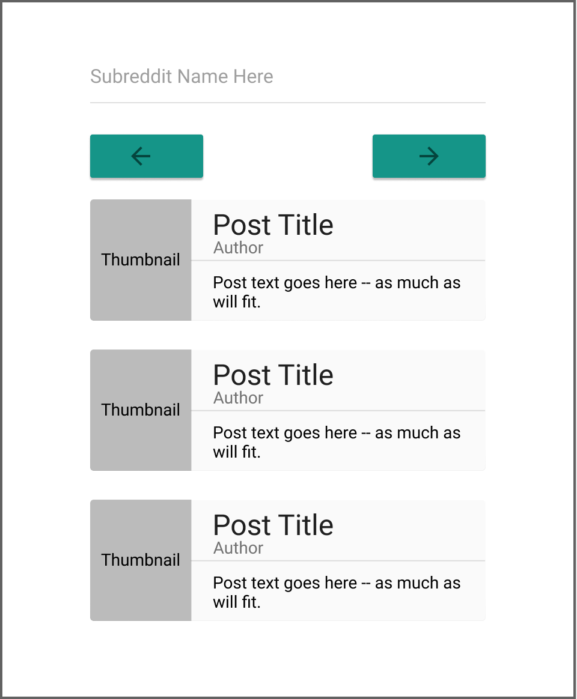

# Frame.ai Coding Challenge

> Welcome to the Frame Coding Challenge!

## Overview

The goal of this challenge is to showcase your ability to design and implement a simple [React](https://facebook.github.io/react/) web app.

We expect you will spend approximately 1 to 3 hours on this project.

**We are looking for solutions that deliver a balance of quality user experience, effective component design, and project organization.**

Our team will conduct a careful review of your submission, and if your it meets our evalulation criteria, then we will use it to guide a code-review style technical session where we learn more about your design and implementation choices and discuss techniques you might apply on a larger and more complex project.

We value your time and appreciate your willingness to complete our code challenge.  Thank you.

## The Challenge

Your mission is to create a minimal single-page react app implementing a [subreddit](https://en.oxforddictionaries.com/definition/subreddit) viewer.  You will allow a user to enter a subreddit name, and then you will render the top entries of that subreddit stream.

For example, if I entered `cats` into your app I would see your novel display of the [cats subreddit feed](https://www.reddit.com/r/cats/).  Using the provided screens as inspiration, you'll need to build a set of React components to render the app.  You'll also need to request a JSON feed, filter that data, and use the relevant fields.

Here's a potential layout for your app:

- A new subreddit could be downloaded based on all changes to the input field, a timer, a submit button, or anything else you choose.
- The site should display three comments at a time, providing pagination buttons (or another method) to move through the longer list.

## Solution Format

Although this is a basic exercise, we'll be looking for **simple, well-designed, and tested code** in the submission.

Submit your solution by emailing a tarball archive to jobs@frame.ai.  Please include a `README` with setup instructions, and any tests or other documentation you created as part of your solution.

Also, add the following info to your `README`:

* What did you focus on to create a quality user experience?
* What is your component design and project organization methodology?
* How did you decide which technologies to use as part of your solution?
* Are there any improvements you could make to your submission?
* What would you do differently with more time?

## Details

All subreddits can be read by appending `.json` to the end of the url.  So, the Cats subreddit at `https://www.reddit.com/r/cats/` can be consumed as a json blob at `https://www.reddit.com/r/cats.json`.  A sample blob is provided as [`feed/sample.json`](feed/sample.json).

A deployable solution should be built in a folder named **`dist`** with an entry point file of **`index.html`**.

Assets are provided in the `assets` folder.

The pages should also be usable (but not necessarily polished) on mobile devices.

You can assume that you do not have to support legacy browsers without features such as `fetch` or `flexbox`.

## FAQ

### What language, framework, build tool... should I use?

You may use whatever you like as long as the solution is built using [React](https://facebook.github.io/react/).

### What do I do if I have questions or find the instructions unclear?

Head over to our [website](https://frame.ai) and start a conversation with us right on the page.  We'll get back to you right away if it's during business hours, otherwise feel free to send an email to jobs@frame.ai

## Useful Links

* [Bitbucket](https://bitbucket.org/) - Source code hosting, with free private repositories for small teams.
* [Google Fonts - Raleway](https://fonts.google.com/?selection.family=Raleway)
* [React](https://facebook.github.io/react/)
